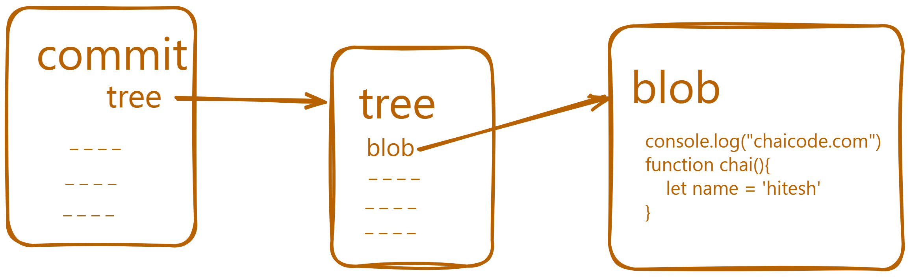

# GIT:
## Version Control System
1. Can access previous versions of file and saved changes.
2. track history of changes.


will watch it from youtube.
## Chai with code: 
* [Link for the video, I am learning from](https://youtu.be/q8EevlEpQ2A?si=BazUX6eWBrwS9acd)
* [Link for the docs for the same](https://docs.chaicode.com/git-and-github/)
31.dec.2024


## Terminologies-
1. git -v
   git version 2.46.2.windows.1
2. git status
   On branch main
   Your branch is up to date with 'origin/main'.
3. git branch -m newName
   change branch name to new name
    main changed to   * WebdevWithHarkirat
4. steps or stages-
   * git init -- initialize a particular folder within bunch of folders
   * git add <file1> <file2> -- add particular/selected files to track within folder among all the files.
   * git add . -- add all files
   * git rm --cached <file1> -- remove files from staged files
   * git commit "commit message" -- commit the changes 
   * git log -- all commits with message and other information
commit 517348cad0c7f53c26fa1a771450e16a3de96e42 (HEAD -> WebdevWithHarkirat, origin/main, origin/HEAD)
Author: HarshiitaaRajoriiaa <harshitarajoria02@gmail.com>
Date:   Tue Dec 31 10:29:41 2024 +0530

    commit

commit 69d42b33d2324267155cdf18e69d8c9c85be353c
Author: HarshiitaaRajoriiaa <harshitarajoria02@gmail.com>
Date:   Tue Dec 31 10:04:52 2024 +0530

    commit with git learnings

commit de1c5e4fdf34c777f228f717ba366e0e229cfcb1
Author: Harshita Rajoria <harshitarajoria02@gmail.com>
Date:   Fri Nov 15 17:20:46 2024 +0530
  * git log --oneline  -- in one line with concise information
517348c (HEAD -> WebdevWithHarkirat, origin/main, origin/HEAD) **commit**
69d42b3 commit with git learnings
de1c5e4 incomplete express and HTTP video
8b6db57 Learning HTTPS
df0184b Promises need more practice all though done
36ed24f WEEK2 2.1 lecture 1 till promise
d2e6f08 one left 8 questions done
ccc080a WEEK1 complete without questions
36a3d65 Week 1 complete assignment questions need to be done
8aac0a7 last lecture of week1 left
20c114b setting up assignments
4c2df4e setting
30a19eb week 1 1.2 lecture complete
361504e done
5988ca7 WEEk 0 completed
128185f done


  * git ignore -- may have some confidential information 
  * git .gitkeep -- folders which are currently empty but will be in need in future, need to be tracked and but doesn't track empty folders, so .gitkeep file is made in same empty folder 


## Behind the Scenes-
3 Musketeers of git
The three musketeers of git are:

* Commit Object
* Tree Object
* Blob Object


### Commit Object
Each commit in the project is stored in .git folder in the form of a commit object. A commit object contains the following information:
1. Parent Commit Object
2. Author
3. Committer
4. Commit Message
5. Tree Object
```terminal
commit 8aac0a7f555b12624de7f8b1a9be1f1b0d247400
tree 9d04ff6b968d20a9b6734fa7d0ed2bc92688f70f
parent 20c114b424d11da096380106735f38555c01c211
author Harshita Rajoria <harshitarajoria02@gmail.com> 1731164383 +0530
committer Harshita Rajoria <harshitarajoria02@gmail.com> 1731164383 +0530
```

### Tree Object
Tree Object is a container for all the files and folders in the project. It contains the following information:

1. File Mode
2. File Name
3. File Hash
4. Parent Tree Object
Everything is stored as key-value pairs in the tree object. The key is the file name and the value is the file hash.

### Blob Object
Blob Object is present in the tree object and contains the actual file content. This is the place where the file content is stored.


``` terminal 
git show -s --pretty=raw <commit-hash>
git ls-tree <tree-id>
git show <blob-id>
git cat-file -p <commit-id>
```


## Branches-
* create a new branch learning with head on main branch = WebdevWithHarkirat
``` terminal
git branch learning
PS C:\Users\dell\OneDrive\Desktop\WebDev\Full-Stack-Web-Dev\WEEK2\GitandGithub> git branch
* WebdevWithHarkirat
  learning

```
* branch switched- now head pointing to learning branch
``` terminal 
PS C:\Users\dell\OneDrive\Desktop\WebDev\Full-Stack-Web-Dev\WEEK2\GitandGithub> git switch learning
D       WEEK2/.gitignore
D       WEEK2/.gitkeep
M       WEEK2/GitandGithub/GitAndGithub.md

PS C:\Users\dell\OneDrive\Desktop\WebDev\Full-Stack-Web-Dev\WEEK2\GitandGithub> git branch
  WebdevWithHarkirat
* learning
```
* git merge
* git merge --abort