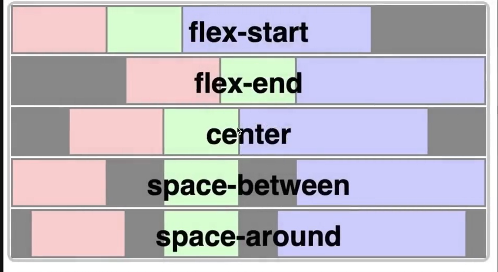
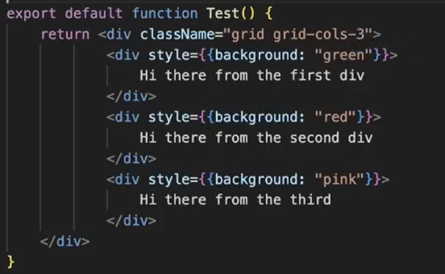
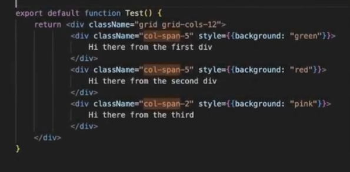
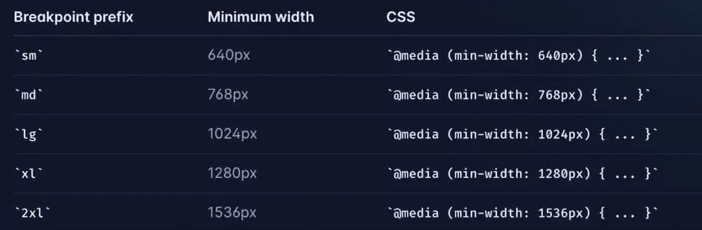

1. Flex = in same line
2. Justify content

3. Grid : 
   grid equals spaces(grid-col-3 ) , unequals spaces(col-span-n) 
4. Responsiveness:  **need more practice**
    These are five break points we need to work in these breakpoints to make our website responsiveness
   sm:text-center (mobile view text @center)